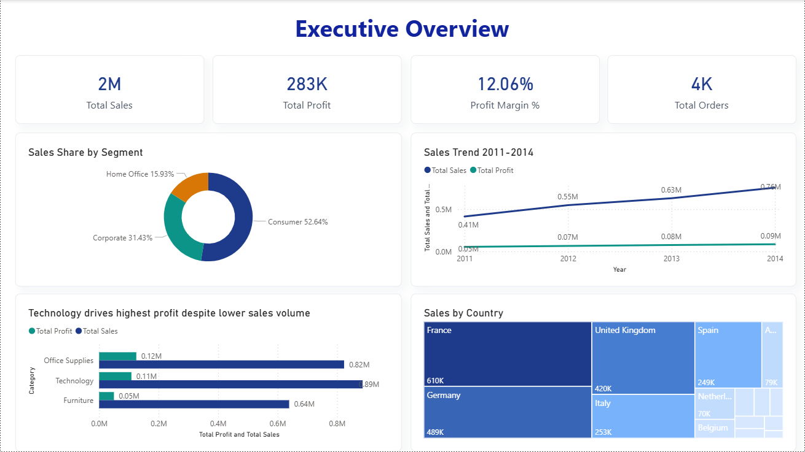
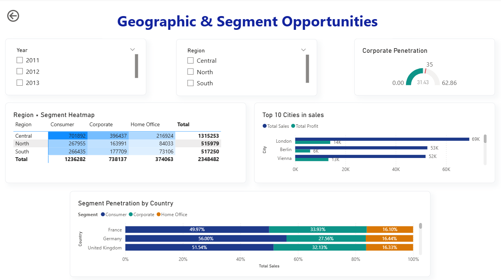
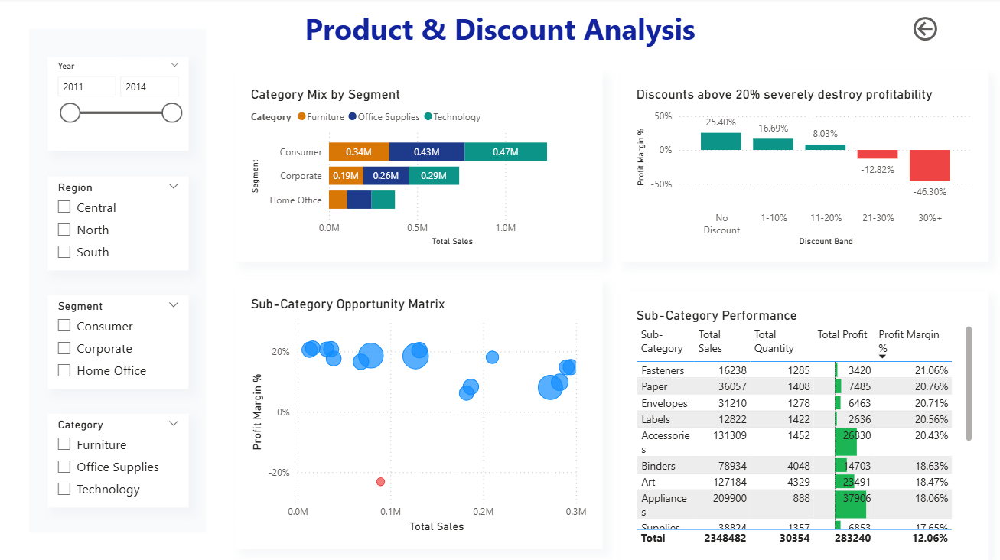

# Commercial Opportunities Analysis (DMart F&B Division)

## 📌 Project Overview
This project is an end-to-end commercial data analytics solution built for the Sales Director of DMart's Food & Beverages Division. The goal was to analyze 4 years of transactional data across 15 European markets to identify high-margin growth opportunities, optimize pricing strategies, and discover under-penetrated segments.

**Role:** Data Analyst  
**Tools Used:** Power BI, DAX, Python (Pandas), Excel  

## 🎯 Business Problem
The Sales Director ("Shaun") required an "Opportunities Analysis" to prepare for an upcoming annual conference. The core objectives were:
1. Understand the current share of spend across existing customer segments (Consumer, Corporate, Home Office).
2. Identify adjacent geographic and segment opportunities for expansion.
3. Analyze profitability drivers and highlight areas of margin leakage (e.g., discounting strategies).

## 🛠️ Technical Solution
1. **Data Engineering (Python):** 
   - Processed the raw transactional dataset (8,000+ records).
   - Engineered a clean **Star Schema** data model featuring a central `Fact_Orders` table and comprehensive dimension tables (`Dim_Date`, `Dim_Geography`, `Dim_Customer`, `Dim_Product`) ready for BI ingestion.
2. **Data Modeling & DAX (Power BI):**
   - Built a robust relational model.
   - Developed 20+ DAX measures for dynamic calculations including `Profit Margin %`, `YoY Growth`, and `Corporate Penetration`.
3. **Interactive Dashboard Design:**
   - Designed an executive-level, 3-page Power BI dashboard utilizing modern UX principles, analytical storytelling titles, and granular drill-down capabilities.

## 📊 The Dashboard

*(Note: Add the screenshots you took to a folder named `dashboards/` in this repository to make these images visible!)*

### 1. Executive Overview

*High-level summary of total sales, profit, margins, and category performance.*

### 2. Geographic & Segment Opportunities

*Drill-down into regional performance, highlighting under-penetrated markets.*

### 3. Product & Discount Analysis

*Granular view of sub-category profitability and the severe negative impact of heavy discounting.*

## 💡 Key Strategic Insights
1. **The Corporate Segment is the Ultimate Growth Lever:** While 'Consumer' dominates volume (51.8%), the 'Corporate' segment yields higher average margins and shows a strong 24.9% CAGR.
2. **Discounting >20% Destroys Margin:** The data revealed that offering discounts above 20% results in negative ROI (dropping to -46% margin at the 30%+ discount band). Capping discounts at 15% is strongly recommended.
3. **Geographic Expansion Opportunity:** The Central region is highly mature (55% of revenue). However, 6 smaller European markets have less than 28% Corporate penetration, representing a massive untapped expansion opportunity.
4. **Product Optimization:** 'Technology' drives the highest profit despite lower sales volume. Conversely, the 'Tables' sub-category operates at a heavy loss (-23.2% margin) and requires immediate pricing restructure.

## 📂 Repository Structure
- `DMart_PowerBI_Data.xlsx`: The Star Schema structured data used for the Power BI model.
- `prepare_powerbi_data.py`: Python script used to clean the raw data and generate the Star Schema.
- `dmart_analysis.py`: Python script containing comprehensive Exploratory Data Analysis (EDA).
- `DMart_Opportunities_Analysis.pptx`: Executive summary presentation.
- `dashboards/`: Directory containing the final Power BI file (`.pbix`) and screenshots.
